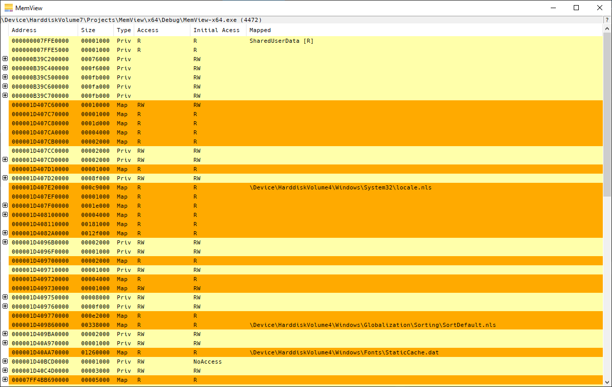
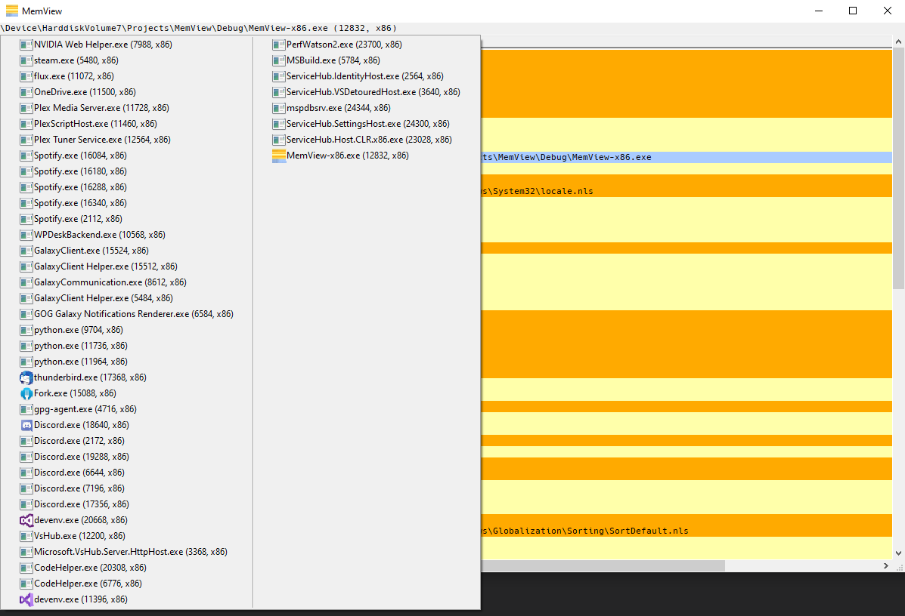

# MemView

## Why MemView?
MemView makes it easy to see all mapped memory in a single process. Included is information about memory protection.
Memory is grouped based on allocations.

## Features

* Show all memory regions
* Show mapped filenames
* Show SharedUserData / PEB
* Select any running process (that can be accessed)
* Includes a hex-viewer to show the memory (live-updated)

## Screenshots

Main window:

Hex-viewer:

Process selection:

